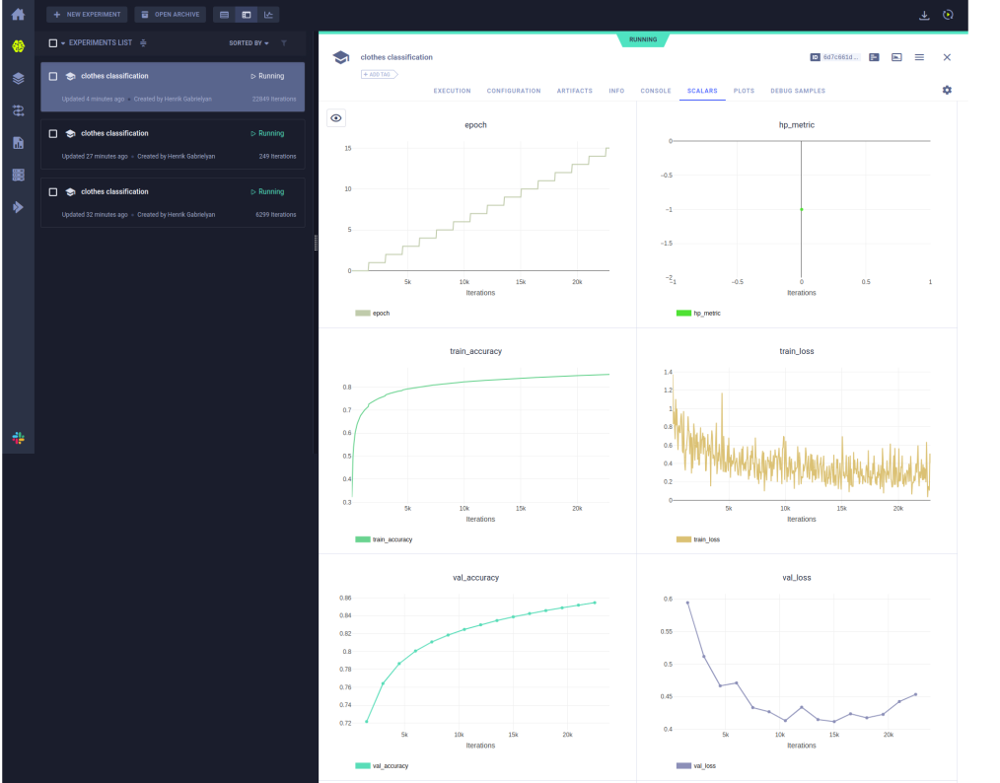

# clearml-pytorch-lightning-demo

Example of using ClearML with PyTorch Lightning for training a simple FashionMNIST classifier.

# Installation
1. Download python requirements with `pip install -r requirements.txt`
2. Run in terminal `clearml-init` and follow the instructions (make sure to have an account on [ClearML](https://app.clear.ml/))
3. After that you will have `clearml.conf` file in your home directory. Add the following lines to the file:
    ```yaml
    api:
    web_server: https://app.clear.ml
    api_server: https://api.clear.ml
    files_server: https://files.clear.ml
    credentials:
        access_key: <your access key>
        secret_key: <your secret key>
    ```
4. Run `python download_dataset.py` to download the FashionMNIST dataset
5. Run `python upload_dataset.py` to upload the dataset to ClearML
6. Run `python train.py` to train the model (Copy dataset id from `https://app.clear.ml/datasets`)

ClearML dashboard
